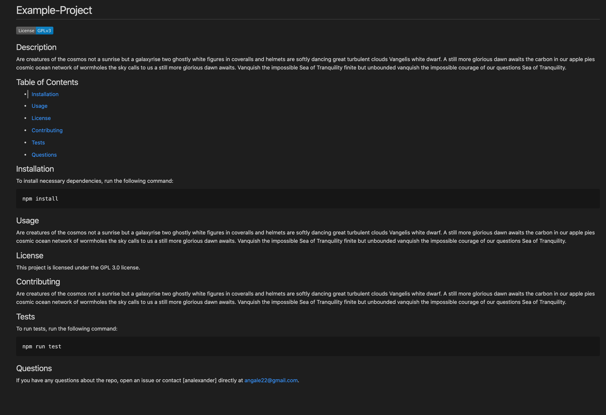

# README Generator

## Description

This project creates a README file based on user input in Node.js. The user is prompted with a series of questions about their project and those answers are then populated to a README file.

## Table of Contents

* [Installation](#Installation)

* [Usage](#Usage)

* [License](#License)

* [Contributing](#Contributing)

* [Tests](#Tests)

* [Questions](#Questions)

## Installation

To install necessary dependencies, run the following command: 
````
npm install
````

## Usage

To start the application (with Mac):

Navigate to file and type:
````
node index.js
````

Upon pressing enter, a prompt list of questions will appear and the user can answer the prompts accordingly:


When the prompts are finished, in the repo there will be a README file that was generated with the corresponding information that the user had entered in the prompts.



## License

This project has no license.

## Contributing

[analexander] angale22@gmail.com

## Tests

To run tests, run the following command: 
````
npm run test
````

## Questions

If you have any questions about the repo, open an issue or contact [analexander] directly at angale22@gmail.com.